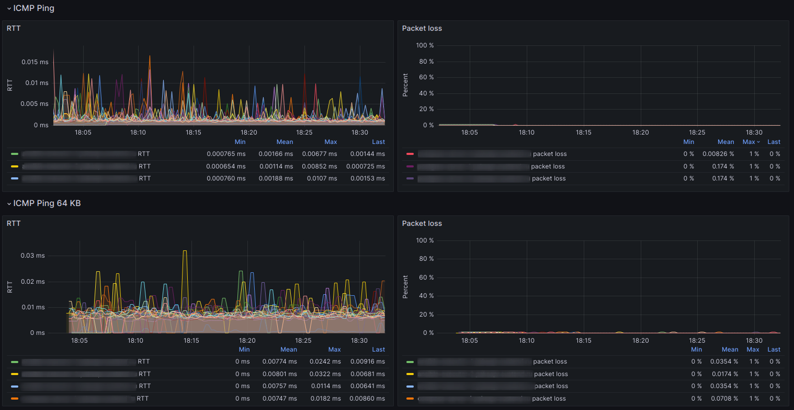

# Grafana dashboard for Prometheus Blackbox exporter ICMP ping RTT and packet loss visualization



### Prometheus Blackbox exporter configuration
```yaml
modules:
  icmp:
    prober: icmp
    timeout: 5s
    icmp:
      preferred_ip_protocol: ip4
      ip_protocol_fallback: false
  icmp_64kb:
    prober: icmp
    timeout: 5s
    icmp:
      preferred_ip_protocol: ip4
      ip_protocol_fallback: false
      payload_size: 64000
```

### Prometheus scrape configuration
```yaml
- job_name: 'blackbox-icmp-ping'
  scrape_interval: 5s
  metrics_path: /probe
  params:
    module: [icmp]
  static_configs:
    - targets:
      - localhost
      - server1.example.com
      - server2.example.com
      - server3.example.com
  relabel_configs:
    - source_labels: [__address__]
      target_label: __param_target
    - source_labels: [__param_target]
      target_label: instance
    - target_label: __address__
      replacement: 127.0.0.1:9115  # This is your blackbox exporter.

- job_name: 'blackbox-icmp-ping-64kb'
  scrape_interval: 30s
  metrics_path: /probe
  params:
    module: [icmp_64kb]
  static_configs:
    - targets:
      - localhost
      - server1.example.com
      - server2.example.com
      - server3.example.com
  relabel_configs:
    - source_labels: [__address__]
      target_label: __param_target
    - source_labels: [__param_target]
      target_label: instance
    - target_label: __address__
      replacement: 127.0.0.1:9115  # This is your blackbox exporter.
```
